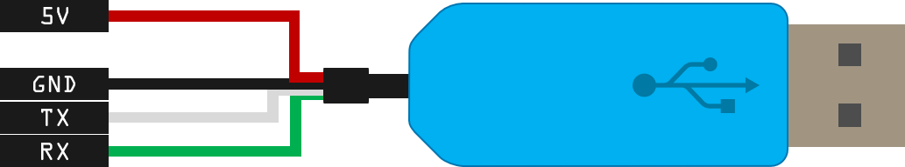
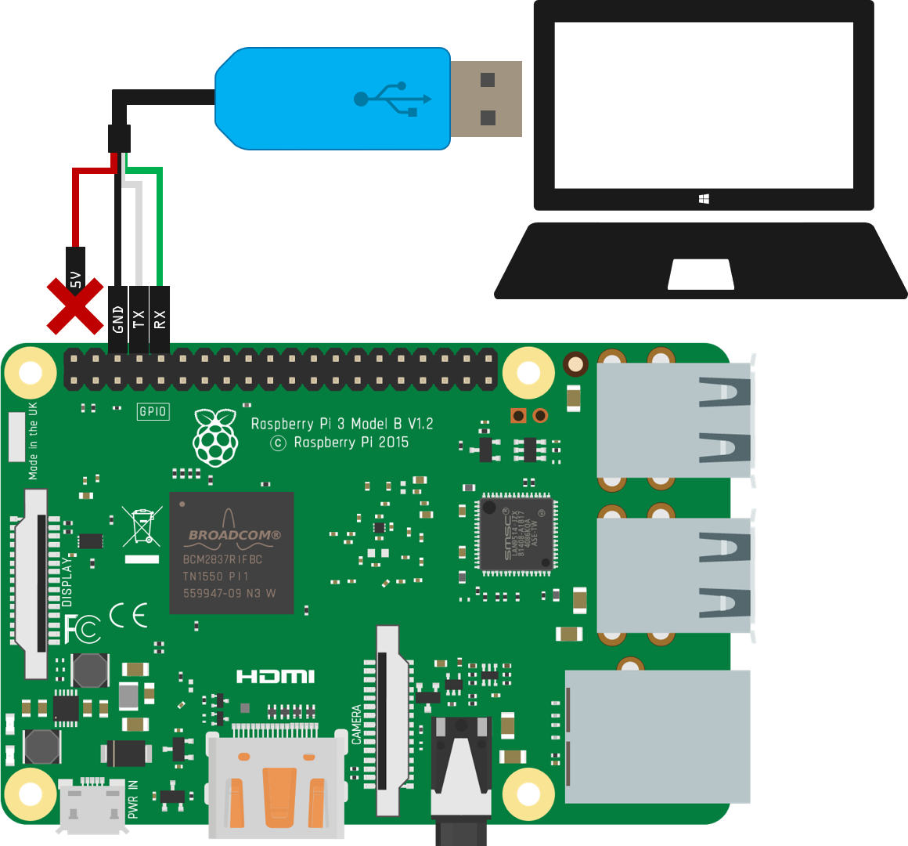
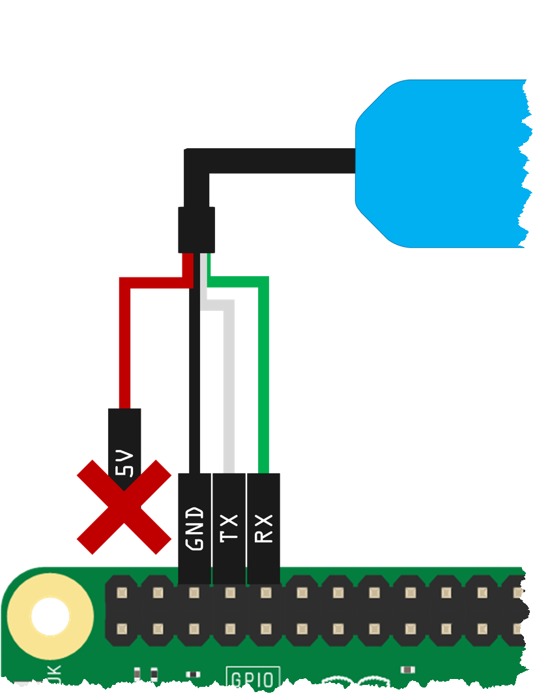

# headlesspi

This repo outlines steps for working with a Raspberry Pi from your computer without a monitor, keyboard or mouse attached to the pi.

The instructions in this repo assume you'll be using the Raspbian OS, however these same instructions should work (perhaps with some modification) on other distros for the pi.

Also, so far I've only tested these steps on a Raspberry Pi 2 Model B+ and a Raspberry Pi 3 Model B.  Not sure how it will work on other versions, but I would expect them to work with no or minimal modifications.

## What you DON'T Need

- Monitor attached to the Pi
- Keyboard attatched to the Pi
- Mouse attached to the Pi

## What you DO Need

- Another computer (Windows, macOS, Linux, Unix, really anything you can use to ssh into the Pi and prepare the Micro SD card with).
- A Micro SD card to load the Pi's Raspibian OS onto
- A way to mount the Micro SD card on your computer.  This could be an integrated slot, an external USB reader, whatever.
- A 5V/2.5A or better Micro USB Power Supply to power the Pi
- A USB to TTL Serial FTDI Cable that supports 3.3v pins like this one from Adafruit: [USB to TTL Serial Cable - Debug / Console Cable for Raspberry Pi](https://www.adafruit.com/product/954)

## What you MIGHT Want

- An available Ethernet network and cable if you want to attach the Pi to it
- An available WiFi network and ssid/pwd if you want to attach the Pi to it
- Whatever else it is you want to hookup to your Pi.

## What We'll Cover:

- [Preparing the OS Image and Booting the Pi](#osprep)
- [Enable the UART on the Pi](#enableuart)
- [Connect the USB to Serial Cable](#usbtoserial)
- [Install the Drivers](#drivers)
- [Determine the USB to Serial Port](#usbport)

---

<a name="osprep"></a>

## Preparing the OS Image and Booting the Pi

If you already have a Pi up and running with an OS, you don't need to do this task.  You can skip down to and move on.

1. Download the image for the Raspbian OS as a “.zip” (DON'T get NOOBs) from:

    > **Note**: There isn't anything wrong with NOOBS, but we don't need it, and this repo doesn't document the extra steps you'll need to use it, so just download the OS as a ".zip".  Again though if you already have a Pi that you got running using NOOBs, you can certainly use it, just skip down to ... and continue!

    https://www.raspberrypi.org/downloads/raspbian/


1. If you need an older version, checkout: http://downloads.raspberrypi.org/raspbian/images/
For example, the last version of Raspbian “Jessie” is at: http://downloads.raspberrypi.org/raspbian/images/images/raspbian-2017-07-05/2017-07-05-raspbian-jessie.zip

1. Download and install Etcher.io for your platform fromhttps://etcher.io/

1. Insert the Micro-SD card for the pi into your computer

1. Use Etcher.io to flash the OS image “.zip” file to the SD card.  It should be pretty obvious but:

    - Pick the Raspbian OS ".zip" file you downloaded previously as the "Image"
    - Select the Micro SD card you inserted above as the "Drive"
    - Click the "Flash" button to flash the image onto the SD card.  It'll take a few minutes to copy the whole image and verify it so please wait patiently until it is done.

---

<a name="#enableuart"></a>

##  Enable the UART on the Pi

The clock speed on the Raspberry Pi 3s messes with the UART baud rate and will cause issues when we attempt to connect to it later with the USB to TTL Serial cable.  To fix the problem, we need to edit the `config.txt` file in the root of the Pi's SD card.

1. Make sure the Micro SD card with your Pi's OS is inserted into your computer, and locate the drive with the `boot` volume label.

1. Locate the `config.txt` file in the root of the `boot` partition and open the the `config.txt` file in the text editor of your choice.

1. Add the following two lines to the bottom of the `config.txt` file and save the changes:

    > **Note**: You should ensure that the `enable_uart` setting isn't being set somewhere else in the `config.txt` file already if this is a pre-existing OS image.

    ```text
    # Enable UART
    enable_uart=1
    ```

1. Now you can safely eject the Micro SD card and insert it into your Raspberry Pi's SD card slot.

---

<a name="drivers"></a>

## Install the Drivers

If you haven't use the USB to Serial cable before on your machine, you may need to install the drivers for it.  To keep it simple we'll just point you off to the instructions for [Adafruit's tutorial](https://learn.adafruit.com/adafruits-raspberry-pi-lesson-5-using-a-console-cable) on their cable:

- [Software Installation (Mac)](https://learn.adafruit.com/adafruits-raspberry-pi-lesson-5-using-a-console-cable/software-installation-mac)
- [Software Installation (Windows)](https://learn.adafruit.com/adafruits-raspberry-pi-lesson-5-using-a-console-cable/software-installation-windows)
- [Software Installation (Linux)](https://learn.adafruit.com/adafruits-raspberry-pi-lesson-5-using-a-console-cable/software-installation-linux)

---

<a name="usbtoserial"></a>

## Connect the USB to Serial Cable

1. Get a USB to TTL Serial FTDI Cable that supports 3.3v pins like this one from Adafruit: [USB to TTL Serial Cable - Debug / Console Cable for Raspberry Pi](https://www.adafruit.com/product/954)

    

1. Connect the USB to Serial Cable to your Pi as follows:

    | Cable Lead | Lead Color | Pin # | Pin Name  | 
    | ---------- | ---------- | ----- | --------- |
    | 5V         | Red        |   N/A | N/A       |
    | GND        | Black      |     6 | GND       |
    | TX         | White      |     8 | UART0_TXD |
    | RX         | Green      |    10 | UART0_RXD |

    
    

1. Connext the USB end of the USB to Serial cable to a USB port on your computer.

---

<a name="usbport"></a>

## Determine the USB to Serial Port

Next, you need to determine what serial port the USB to Serial cable is connected to on your computer.  The process for doing that is different on each platform.

> **Note**: These steps are blatantly stolen from [Adafruit's awesome tutorial](https://learn.adafruit.com/adafruits-raspberry-pi-lesson-5-using-a-console-cable) on their cable.  For more detailed instructions, checkout: https://learn.adafruit.com/adafruits-raspberry-pi-lesson-5-using-a-console-cable/test-and-configure

1. For Windows Users:

    - Open the Windows "**Device Manager**"
    - Expand "**Ports (COM & LPT)**"
    - Find the "**Prolific**" (or other) Device and it's COM port Number.

1. For Mac Users:


---

<a name=""></a>

## 


---

<a name=""></a>

## 


---

<a name=""></a>

## 


---

<a name=""></a>

## 


---

<a name=""></a>

## 


---

<a name=""></a>

## 


---

<a name=""></a>

## 


---

<a name=""></a>

## 


---

<a name=""></a>

## 


---

<a name=""></a>

## 


---

<a name=""></a>

## 


---

<a name=""></a>

## 


---

<a name=""></a>

## 


---

<a name=""></a>

## 


---

<a name=""></a>

## 

