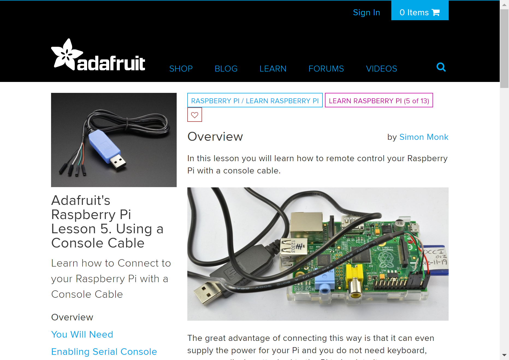

# headlesspi

This repo outlines steps for working with a Raspberry Pi from your computer without a monitor, keyboard or mouse attached to the pi.

The instructions in this repo assume you'll be using the Raspbian OS, however these same instructions should work (perhaps with some modification) on other distros for the pi.

Also, so far I've only tested these steps on a Raspberry Pi 2 Model B+ and a Raspberry Pi 3 Model B.  Not sure how it will work on other versions, but I would expect them to work with no or minimal modifications.

## What you DON'T Need

- Monitor attached to the Pi
- Keyboard attatched to the Pi
- Mouse attached to the Pi

## What you DO Need

- Another computer (Windows, macOS, Linux, Unix, really anything you can use to ssh into the Pi and prepare the Micro SD card with).
- A Micro SD card to load the Pi's Raspibian OS onto
- A way to mount the Micro SD card on your computer.  This could be an integrated slot, an external USB reader, whatever.
- A 5V/2.5A or better Micro USB Power Supply to power the Pi
- A USB to TTL Serial FTDI Cable that supports 3.3v pins like this one from Adafruit: [USB to TTL Serial Cable - Debug / Console Cable for Raspberry Pi](https://www.adafruit.com/product/954)

## What you MIGHT Want

- An available Ethernet network and cable if you want to attach the Pi to it
- An available WiFi network and ssid/pwd if you want to attach the Pi to it
- Whatever else it is you want to hookup to your Pi.

## What We'll Cover:

- [Preparing the OS Image and Booting the Pi](#osprep)
- [Complete Adafruits USB to Serial Cable Tutorial](#adafruittut)

---

## Preparing the OS Image and Booting the Pi

If you already have a Pi up and running with an OS, you don't need to do this task.  You can skip down to and move on.

1. Download the image for the Raspbian OS as a “.zip” (DON'T get NOOBs) from:

    > **Note**: There isn't anything wrong with NOOBS, but we don't need it, and this repo doesn't document the extra steps you'll need to use it, so just download the OS as a ".zip".  Again though if you already have a Pi that you got running using NOOBs, you can certainly use it, just skip down to ... and continue!

    https://www.raspberrypi.org/downloads/raspbian/

1. If you need an older version, checkout: http://downloads.raspberrypi.org/raspbian/images/
For example, the last version of Raspbian “Jessie” is at: http://downloads.raspberrypi.org/raspbian/images/images/raspbian-2017-07-05/2017-07-05-raspbian-jessie.zip

1. Download and install Etcher.io for your platform fromhttps://etcher.io/

1. Insert the Micro-SD card for the pi into your computer

1. Use Etcher.io to flash the OS image “.zip” file to the SD card.  It should be pretty obvious but:

    - Pick the Raspbian OS ".zip" file you downloaded previously as the "Image"
    - Select the Micro SD card you inserted above as the "Drive"
    - Click the "Flash" button to flash the image onto the SD card.  It'll take a few minutes to copy the whole image and verify it so please wait patiently until it is done.

---

## Complete Adafruits USB to Serial Cable Tutorial

I had started writing my own documentation to help you get the USB to Serial cable setup on your Pi and computer but I quickly realized I was really just stealing the work that Adafruit has already done so admirably.  Plus, they'll probably be able to keep their docs up to date easier than I can so...

1. Complete "[Adafruit's Raspberry Pi Lesson 5. Using a Console Cable](https://learn.adafruit.com/adafruits-raspberry-pi-lesson-5-using-a-console-cable)" tutorial.  Make sure to get all they way through, and when you're done, return here for more goodness.

    

---

## 

---

## 

---

## 

---

## 

---

## 

---

## 

---

## 

---

## 

---

## 

---

## 

---

## 

---

## 

---

## 

---

## 

