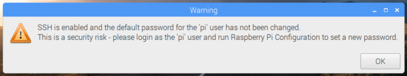

# Headless Pi


This repo outlines steps for working with a Raspberry Pi from your computer without a monitor, keyboard or mouse attached to the pi.

The instructions in this repo assume you'll be using the Raspbian OS, however these same instructions should work (perhaps with some modification) on other distros for the pi.

Also, so far I've only tested these steps on a Raspberry Pi 2 Model B+ and a Raspberry Pi 3 Model B.  Not sure how it will work on other versions, but I would expect them to work with no or minimal modifications.

## What you DON'T Need

- Monitor attached to the Pi
- Keyboard attatched to the Pi
- Mouse attached to the Pi

## What you DO Need

- Another computer (Windows, macOS, Linux, Unix, really anything you can use to ssh into the Pi and prepare the Micro SD card with).
- A Micro SD card to load the Pi's Raspibian OS onto
- A way to mount the Micro SD card on your computer.  This could be an integrated slot, an external USB reader, whatever.
- A 5V/2.5A or better Micro USB Power Supply to power the Pi
- A USB to TTL Serial FTDI Cable that supports 3.3v pins like this one from Adafruit: [USB to TTL Serial Cable - Debug / Console Cable for Raspberry Pi](https://www.adafruit.com/product/954)

## What you MIGHT Want

- An available Ethernet network and cable if you want to attach the Pi to it
- An available WiFi network and ssid/pwd if you want to attach the Pi to it
- Whatever else it is you want to hookup to your Pi.

## What We'll Cover:

- [Preparing the OS Image and Booting the Pi](#osprep)
- [Complete Adafruits USB to Serial Cable Tutorial](#adafruittut)
- [Enable UART](#enableuart)
- [Boot the Pi](#boot)
- [Connect via Serial](#connectserial)
- [Enable SSH & VNC](#enableinterfaces)
- [Configuring the WiFi Network](#wificonfig)
- [Set the Pi's Hostname](#hostname)
- [Configure SSH Keys](#sshkeys)
- [Configure the Display Resolution](#displayresolution)
- [Connecting with VNC](#vnc)
- [Install and Configure Samba](#samba)
- [Install and Configure Git](#git)
- [OPTIONAL: Install Node.js](#nodejs)
- [OPTIONAL: Install the Azure IoT Device SDK for Python](#azureiot)
- [OPTIONAL: Configure SPI](#spiconfig)

---

<a name="osprep"></a>

## Preparing the OS Image and Booting the Pi

If you already have a Pi up and running with an OS, you don't need to do this task.  You can skip down to and move on.

1. Download the image for the Raspbian OS as a “.zip” (DON'T get NOOBs) from:

    > **Note**: There isn't anything wrong with NOOBS, but we don't need it, and this repo doesn't document the extra steps you'll need to use it, so just download the OS as a ".zip".  Again though if you already have a Pi that you got running using NOOBs, you can certainly use it, just skip down to ... and continue!

    https://www.raspberrypi.org/downloads/raspbian/


1. If you need an older version, checkout: http://downloads.raspberrypi.org/raspbian/images/
For example, the last version of Raspbian “Jessie” is at: http://downloads.raspberrypi.org/raspbian/images/images/raspbian-2017-07-05/2017-07-05-raspbian-jessie.zip

1. Download and install Etcher.io for your platform fromhttps://etcher.io/

1. Insert the Micro-SD card for the pi into your computer

1. Use Etcher.io to flash the OS image “.zip” file to the SD card.  It should be pretty obvious but:

    - Pick the Raspbian OS ".zip" file you downloaded previously as the "Image"
    - Select the Micro SD card you inserted above as the "Drive"
    - Click the "Flash" button to flash the image onto the SD card.  It'll take a few minutes to copy the whole image and verify it so please wait patiently until it is done.

---

<a name="adafruittut"></a>

## Complete Adafruits USB to Serial Cable Tutorial

I had started writing my own documentation to help you get the USB to Serial cable setup on your Pi and computer but I quickly realized I was really just stealing the work that Adafruit has already done so admirably.  Plus, they'll probably be able to keep their docs up to date easier than I can so...

1. Complete "[Adafruit's Raspberry Pi Lesson 5. Using a Console Cable](https://learn.adafruit.com/adafruits-raspberry-pi-lesson-5-using-a-console-cable)" tutorial.  Make sure to get all they way through, and when you're done, return here for more goodness.

    

---

<a name="enableuart"></a>

## Enable UART

If you completed the Adafruit Tutorial above you should have done this already, this step is just here for clarification purposes and to make sure that you complete it, otherwise you will likely have issues connecting to your Pi over the USB to Serial cable on newer versions of the Pi hardware and Operating System:

The clock speed on the Raspberry Pi 3s messes with the UART baud rate and will cause issues when we attempt to connect to it later with the USB to TTL Serial cable.  To fix the problem, we need to edit the `config.txt` file in the root of the Pi's SD card.

1. Make sure the Micro SD card with your Pi's OS is inserted into your computer, and locate the drive with the `boot` volume label.

1. Locate the `config.txt` file in the root of the `boot` partition and open the the `config.txt` file in the text editor of your choice.

1. Add the following two lines to the bottom of the `config.txt` file and save the changes:

    > **Note**: You should ensure that the `enable_uart` setting isn't being set somewhere else in the `config.txt` file already if this is a pre-existing OS image.

    ```text
    # Enable UART
    enable_uart=1
    ```

1. Now you can safely eject the Micro SD card and insert it into your Raspberry Pi's SD card slot.

---

<a name="boot"></a>

## Boot the Pi

1. Ensure that, in the following order:

    - The Micro SD card is inserted into the SD Card slot on the back of the Pi
    - The USB to Serial cable to the Pi's leads are properly connected to the Pi
        | Lead | Pin            | 
        | ---- | -------------- |
        |   5V | Not Connected  |
        |  GND |  6 (GND)       |
        |   TX |  8 (UART0_TXD) |
        |   RX | 10 (UART0_RXD) |

    - The USB end of the USB to serial cable is connected to your computer
    - If you are on a Raspberry Pi 2 and want to use WiFi, that a WiFi dongle is plugged into a USB port.
    - If you want to use Ethernet, that the Ethernet cable is plugged into the Pi's Ethernet port, and to the network.

    

1. Once you have ensured all of the above, you can connect the Micro USB power supply to the Pi to boot it.

    

---

<a name="connectserial"></a>

## Connect via Serial

Again, you likely completed this already if you completed the Adafruit Tutorial above, but to ensure we are all starting from the same place:

1. Use the steps from the [Test & Configure](https://learn.adafruit.com/adafruits-raspberry-pi-lesson-5-using-a-console-cable/test-and-configure) page of "[Adafruit's Raspberry Pi Lesson 5. Using a Console Cable](https://learn.adafruit.com/adafruits-raspberry-pi-lesson-5-using-a-console-cable)" tutorial to connect to your Raspberry Pi over the USB to Serial cable using a terminal program on your computer. 

1. Login to the Pi:

    > **Note**: You may need to press the `ENTER` or key on your keyboard in the terminal once connected to get to the login prompt.  Also, if you have already changed the credentials on your Pi, use those instead.

    - User Name: `pi`
    - Password: `raspberry`

---

<a name="enableinterfaces"></a>

## Enable SSH & VNC

At this point you can connect to your pi only from a computer that is attached using the USB to Serial cable. If you want to connect to your pi over the network, you will need to enable ssh and/or vnc on the pi.

1. Ensure you are connected to your Pi over the USB to Serial cable in and logged in as described above.  

1. From the command prompt run the following two commands to enable ssh & vnc (or optionally run just the command for the interface you want to enable )

    > **Note**: You can also enable the interfaces interactively by just running `sudo raspi-config`, navigating to `5 Interfacing Options` and iteratively selecting and enabling each interface.  The commands below just allow you to do it more directly and without any manual interaction required.  See the [raspi-config source code](https://github.com/raspberrypi-ui/rc_gui/blob/master/src/rc_gui.c#L23-L70) for other possible commands:

    ```bash
    # Enable the ssh interface on the pi
    # The "0" means "enable".  "1" would mean "disable"
    sudo raspi-config nonint do_ssh 0

    # Enable the ssh interface on the pi
    # The "0" means "enable".  "1" would mean "disable"
    sudo raspi-config nonint do_vnc 0
    ```
1. You can optionally choose to enable other interfaces now as well, or as mentioned you can interactively run `sudo raspi-config` to configure other options like `Hostname`, `Localization Options`, `Interfacing Options` and more.

    ```bash
    # Enable the ssh camera, i2c and spi interfaces
    # The "0" means "enable".  "1" would mean "disable"
    sudo raspi-config nonint do_camera 0
    sudo raspi-config nonint do_i2c 0
    sudo raspi-config nonint do_spi 0
    ```
---

<a name="wificonfig"></a>

## Configure the WiFi Network

The WiFi network configuration on the Pi is done using the [wpa_supplicant](https://wiki.archlinux.org/index.php/WPA_supplicant) by default. You can see this if you look at the default network interfaces configuration:

```bash
cat /etc/network/interfaces
```

You should see output similar to the following:

```bash
# interfaces(5) file used by ifup(8) and ifdown(8)

# Please note that this file is written to be used with dhcpcd
# For static IP, consult /etc/dhcpcd.conf and 'man dhcpcd.conf'

# Include files from /etc/network/interfaces.d:
source-directory /etc/network/interfaces.d

auto lo
iface lo inet loopback

iface eth0 inet manual

allow-hotplug wlan0
iface wlan0 inet manual
    wpa-conf /etc/wpa_supplicant/wpa_supplicant.conf

allow-hotplug wlan1
iface wlan1 inet manual
    wpa-conf /etc/wpa_supplicant/wpa_supplicant.conf
```
Of specific interest is the configuration for `wlan0` and `wlan1`.  Both are set to:

- Allow the wifi device to `allow-hotplug`.  This is handy on a Pi 2 if you have to attach a WiFi dongle to the pi after it is already running. 
- Get their configuration from the `wpa-conf` via the `/etc/wpa_supplicant/wpa_supplicant.conf` file.

Basically, that means you just need to edit `/etc/wpa_supplicant/wpa_supplicant.conf` with the specifics for your WiFi network (`ssid`,`psk`, etc).  However, you need to make sure you enter those values properly.  So you have two choices to edit the contents of that file to specify your WiFi newtwork configuration:

- Using the `wpa_cli` 
- Manually editing the `wpa_supplicant.conf` file

### Sidebar on the WPA Supplicant

What is a "supplicant"? [Vocabulary.com](https://www.vocabulary.com/dictionary/supplicant) explains it as follows:

>_A supplicant can be a fervently religious person who prays to God for help with a problem, and **it can also be someone who begs earnestly for something he or she wants**. A younger brother entreating his sister to be allowed in her tree house could be described as a supplicant. The Latin root word is supplicantem, "plead humbly."_

Note the phrase "_**it can also be someone who begs earnestly for something he or she wants**_".  In our case the `wpa_supplicant` on the raspberry pi will be begging our WiFi Access point to allow it to connect.  To do that we need to give the supplicant a few pieces of information:

- The WiFi Network SSID
- The WiFi Network passphrase / password / Pre-shared key, if there is one

### Using the `wpa_cli`

1. From the prompt on the pi run:

    ```bash
    sudo wpa_cli
    ```
1. Inside the `wpi_cli` interactive prompt, first set the country for your device. For example, here's how to specify the `us` as the country (don't type the "`>`"):

    ```bash
    > set country us
    ```

1. Next, you can scan for available wifi networks, and view the results:

    ```bash
    > scan
    > scan_results
    ```

    You should see a list of available WiFi Networks similar to the following (your list WILL be different and may wrap accross multiple lines):

    ```bash
    bssid / frequency / signal level / flags / ssid
    f4:...:a3  2422  -66  [WPA2-PSK-CCMP][WPS][ESS]  MyWiFiNetwork
    38:...:bb  2412  -70  [WPA2-PSK-CCMP][WPS][ESS]  SomeOtherWiFiNetwork
    ...
    ```
1. Find your network in the list, in this example we'll use `MyWiFiNetwork`, and make sure you know the password, or `psk`, for that network. You'll need it in a couple of steps.

1. In the `wpa_cli`interactive prompt, run:

    ```bash
    > add_network
    ```

    It should return a network number (should be `0` on a fresh Pi).  That number is the index of the network that was added to the config file. `0` is the first network, `1` is the second, etc.  Note that you CAN have multiple networks configured.  You can repeat this process to add the network configuration for all the WiFi networks you want your Pi to attempt to connect to.  It will connect to the first one it can, following the order they are defined.  If you are running this for additional networks replace the "`0`" in the commands that follow with the network index for the network you are configuring.

    ```bash
    0
    ```
    Next, set the ssid/psk for your new network config.  Replace the "`MyWiFiNetwork`" and "`MyWiFiPassword`" with the appropriate values for your network SSID and password.  

    > **Note**: If the WiFi network you are connecting to is Open (doesn't require a password) rather than running `set_network 0 psk "MyWiFiPassword"` run `set_network 0 key_mgmt NONE`

    ```bash
    > set_network 0 ssid "MyWiFiNewtork"
    > set_network 0 psk "MyWiFiPassword"
    ```

    Then, enable the network.  It should immediately attempt to connect:

    ```bash
    > enable_network 0
    ```

    IMPORTANT!!!! Make sure to save the configuration:

    ```bash
    > save_config
    ```

    Then you can quit the `wpa_cli` interactive prompt with:
    
    ```bash
    quit
    ```

1. Verify the WiFi network configuration:

    ```bash
    sudo cat /etc/wpa_supplicant/wpa_supplicant.conf
    ```

    You should see output similar to the following:

    ```bash
    ctrl_interface=DIR=/var/run/wpa_supplicant GROUP=netdev
    update_config=1
    country=US

    network={
            ssid="MyWiFiNetwork"
            psk="MyWiFiPassword"
    }
    ```

    Or, if this was an open network that didn't require a  password:

    ```bash
    ctrl_interface=DIR=/var/run/wpa_supplicant GROUP=netdev
    update_config=1
    country=US

    network={
            ssid="MyWiFiNetwork"
            key_mgmt NONE
    }
    ```

### Manually editing the `wpa_supplicant.conf` file

If you prefer to just manually edit the `wpa_supplicant.conf` file, you can certainly do so.  Just be careful to format it properly. 

1. On the pi, open the `/etc/wpa_supplicant/wpa_supplicant.conf` file in a text editor (we'll use nano):

    ```bash
    sudo nano /etc/wpa_supplicant/wpa_supplicant.conf
    ```
1. Edit the contents of the file to meet your needs.  Here is an example of a simple WiFI network that just needs an SSID and Password (psk). Verify the [two letter country code](https://en.wikipedia.org/wiki/ISO_3166-1_alpha-2) is correct for your device, and replace the "`MyWiFiNetwork`" and "`MyWiFiPassword`" with the appropriate values for your network SSID and password.

    ```bash
    ctrl_interface=DIR=/var/run/wpa_supplicant GROUP=netdev
    update_config=1
    country=US

    network={
            ssid="MyWiFiNetwork"
            psk="MyWiFiPassword"
    }
    ```

    Or, if this was an open network that didn't require a  password:

    ```bash
    ctrl_interface=DIR=/var/run/wpa_supplicant GROUP=netdev
    update_config=1
    country=US

    network={
            ssid="MyWiFiNetwork"
            key_mgmt NONE
    }
    ```
1. Save the changes to your file.  In nano:

    - Press `CTRL-X` to exit
    - Press `Y` to save.
    - Press `ENTER` to confirm the file name

1. Verify that your WiFi adapter got its IP Address:

    ```bash
    ip -4 a
    ```

    You should see output similar to the following, look for the IP Address of `wlan0` (or whatever interface you are interested in). For example, in the output below, the `wlan0` interface's IPv4 address is `192.168.2.24` with a `24` bit subnet mask which really means it's subnet mas is `255.255.255.0`.

    ```bash
    1: lo: <LOOPBACK,UP,LOWER_UP> mtu 65536 qdisc noqueue state UNKNOWN group default qlen 1
        inet 127.0.0.1/8 scope host lo
        valid_lft forever preferred_lft forever
    3: wlan0: <BROADCAST,MULTICAST,UP,LOWER_UP> mtu 1500 qdisc pfifo_fast state UP group default qlen 1000
        inet 192.168.2.24/24 brd 192.168.2.255 scope global wlan0
        valid_lft forever preferred_lft forever
    ```

1. Another way to look at your Pi's ip address is with:

    ```bash
    ifconfig
    ```

    The output is just a little noisier, but if you look under `wlan0` for the `inet addr:` you should see the IP address for the WiFi network:

    ```bash
    eth0      Link encap:Ethernet  HWaddr b8:27:eb:95:eb:21
            inet6 addr: fe80::8c70:f7a7:6fbd:3a7/64 Scope:Link
            UP BROADCAST MULTICAST  MTU:1500  Metric:1
            RX packets:0 errors:0 dropped:0 overruns:0 frame:0
            TX packets:0 errors:0 dropped:0 overruns:0 carrier:0
            collisions:0 txqueuelen:1000
            RX bytes:0 (0.0 B)  TX bytes:0 (0.0 B)

    lo        Link encap:Local Loopback
            inet addr:127.0.0.1  Mask:255.0.0.0
            inet6 addr: ::1/128 Scope:Host
            UP LOOPBACK RUNNING  MTU:65536  Metric:1
            RX packets:261 errors:0 dropped:0 overruns:0 frame:0
            TX packets:261 errors:0 dropped:0 overruns:0 carrier:0
            collisions:0 txqueuelen:1
            RX bytes:20300 (19.8 KiB)  TX bytes:20300 (19.8 KiB)

    wlan0     Link encap:Ethernet  HWaddr b8:27:eb:c0:be:74
            inet addr:192.168.2.24  Bcast:192.168.2.255  Mask:255.255.255.0
            inet6 addr: fe80::8a9:43db:3c5:50e1/64 Scope:Link
            UP BROADCAST RUNNING MULTICAST  MTU:1500  Metric:1
            RX packets:99134 errors:0 dropped:0 overruns:0 frame:0
            TX packets:65765 errors:0 dropped:0 overruns:0 carrier:0
            collisions:0 txqueuelen:1000
            RX bytes:137469393 (131.1 MiB)  TX bytes:12494038 (11.9 MiB)
    ```

1. Lastly, just FYI, you can also inspect your Pi's wireless network status with :

    ```bash
    iwconfig
    ```

    With output similar to the following:

    ```bash
    lo        no wireless extensions.

    wlan0     IEEE 802.11  ESSID:"MyWiFiNetwork"
            Mode:Managed  Frequency:2.422 GHz  Access Point: f4:xx:xx:xx:xx:a3
            Bit Rate=7.2 Mb/s   Tx-Power=31 dBm
            Retry short limit:7   RTS thr:off   Fragment thr:off
            Power Management:on
            Link Quality=44/70  Signal level=-66 dBm
            Rx invalid nwid:0  Rx invalid crypt:0  Rx invalid frag:0
            Tx excessive retries:176  Invalid misc:0   Missed beacon:0

    eth0      no wireless extensions.
    ```

---

<a name="hostname"></a>

## Set the Pi's Hostname

By default, your pi is named "raspberrypi".  You will want to change that for each pi so you can easily refer to them on the network.

The Pi broadcasts is hostname as "`<hostname>.local`" ("`raspberrypi.local`" by default) using the "[Multicast DNS (mDNS)](https://en.wikipedia.org/wiki/Multicast_DNS)" protocol.  By giving each pi a unique hostname, you will be able to refer to them easily by name rather than their IP address on your local network (note, .local names ONLY work locally, on the same network)

There are two files where you need to update your hostname if you want to change it:

    - `/etc/hostname` to set the name itself
    - `/etc/hosts` to set the hostname for the local loopback address (`127.0.0.1`) so your pi can resolve its own name.

1. You can manually edit each of those files using `nano`:

    Start by editing `/etc/hostname`

    ```bash
    sudo nano /etc/hostname
    ```

    Replace `raspberrypi` with your new desired hostname, and save the changes (`CTRL-X`,`Y`,`ENTER` in nano):

    ```
    myhostname
    ```

    Then edit `/etc/hosts`

    ```bash
    sudo nano /etc/hosts
    ```

    Edit the `127.0.0.1` address (usually the last line) to point to your new hostname, and save your changes (`CTRL-X`,`Y`,`ENTER`)

    ```bash
    127.0.0.1       localhost
    ::1             localhost ip6-localhost ip6-loopback
    ff02::1         ip6-allnodes
    ff02::2         ip6-allrouters

    127.0.1.1       myhostname
    ```

1. Alternatively, you can use `raspi-config` to edit both of the files for you:

    ```bash
    sudo rasp-config nonint do_hostname "myhostname"
    ```

1. You should reboot your pi after giving it the new host name.  Go ahead and do that and then log back in when it comes up:

    > **Note**: If you are still connected to the debug console via the USB to Serial cable, you don't need to re-connect.  It should stay connected during the reboot. Cool! SSH or VNC connections however will need to be re-established when the Pi is done rebooting.

    ```bash
    sudo reboot
    ```

1. Then the pi has rebooted, from your computer (ON THE SAME NETWORK AS THE PI), verify you can ping your pi using:

    ```bash
    # Replace <hostname> with your Pi's hostname that you just set
    ping <hostname>.local

    # For example:
    ping myhostname.local

    #or

    # Replace <your.pis.ip.address> with your Pi's IP address
    ping <your.pis.ip.address>

    # For example, if the Pi's ip address is 192.168.2.24:
    ping 192.168.2.24
    ```


---

<a name="sshkeys"></a>

## Configure SSH Keys

If you don't want to have to provide the Raspberry Pi's password everytime you ssh into the pi from a remote computer, you can configure ssh keys to automatically authenticate you.

1. On your computer (not on the pi), run the following command:

    ```bash
    ssh-keygen -t rsa -C "SSH Key for logging into the pi"
    ```

1. Next, from your computer, ssh into the pi normally, using the "`pi`" username and password (password defaults to `raspberry`).  Reaplace `your.pis.ip.address` below with the actual IP address for your pi (see above) or it's `<hostname>.local` mDNS name (again, see above):

    ```bash
    # Replace <hostname> with your Pi's hostname that you just set
    ssh pi@<hostname>.local

    # For example:
    ssh pi@myhostname.local

    #or

    # Replace <your.pis.ip.address> with your Pi's IP address
    ssh pi@<your.pis.ip.address>

    # For example, if the Pi's ip address is 192.168.2.24:
    ssh pi@192.168.2.24
    ```

1. Now, in the ssh session on the Pi, run the following commands to create and configure the `.ssh` folder where the Pi's copy of your ssh keys will be stored:

    ```bash
    cd ~
    install -d -m 700 ~/.ssh
    ```

1. Back on your computer, run the following command, entering the password for the "`pi`" user one last time:

    > **Note**: This command uses cat to display the contents of the ssh public key (`~/.ssh/id_rsa.pub`) on your computer, it sends that output to an ssh session to your pi, and into a command that uses `cat` to pipe the incoming content into the `.ssh/authorized_keys` file on the pi.  Basically copying your ssh public key over to the list of authorized public keys on the pi.

    ```bash
    cat ~/.ssh/id_rsa.pub | ssh pi@your.pi.ip.address 'cat >> .ssh/authorized_keys'
    ```

1. Finally, on your computer, you should now be able to ssh into the pi without having to enter the password:

    ```bash
    ssh pi@<hostname>.local

    #or

    ssh pi@<your.pis.ip.address>

---

<a name="displayresolution"></a>

## Configure the Display Resolution

Even through your pi is "headless" (meaning no monitor, keyboard, and mouse), you may still care about what display resolution the Pi is configured to use if you will be connecting through a graphical client like VNC.

The display configuration for your Pi is stored in the `/boot/config.txt` file (or, more specifially, the `config.txt` file on the `boot` partition).  You can learn more about the configuration options for the display from the [VIDEO OPTIONS IN CONFIG.TXT](https://www.raspberrypi.org/documentation/configuration/config-txt/video.md) document.

Basically though, you need to pick an `hdmi_group` and an `hdmi_mode`.  

Those settings need to be written into the `/boot/config.txt` file.  You could do that manually, just find the existing entries and edit them, or you can use `raspi-config` in either its interactive mode, or non-interactively from the command line.

### hdmi_group

The `hdmi_group` can be one of three values:

| hdmi_group | Result                                   | Description                    | 
| ---------: | ------                                   | ------------------------------ | 
|          0 | Auto-detect from attached monitor's EDID | Won't work on a headless display because there is no monitor attached |
|          1 | CEA                                      | Consumer Electronics Association, the standard typically used by TVs |
|          2 | DMT                                      | Dipslay Monitor Timings, the standard typically used by monitors |

So you can see from above, we'll typically want to stick to `hdmi_group` `2` since we don't have anything attached, and we aren't using an old-school television as our display.

### hdmi_mode

The `hdmi_mode` value you select depends on what `hdmi_group` you selected above.  Since you can read all about it [here](https://www.raspberrypi.org/documentation/configuration/config-txt/video.md), and we'll most likely be using `hdmi_group` `2`, I'll just list some likley `hdmi_mode` selections for `hdmi_group` `2`.  For more choices, refer to the [docs](https://www.raspberrypi.org/documentation/configuration/config-txt/video.md):

| HDMI_GROUP | HDMI_MODE | DESCRIPTION            |
| ---------: | --------: | :--------------------- |
|          2 |        82 | 1920x1080, 60HZ, 1080p |
|          2 |        85 | 1280x720, 60HZ, 720p   |

### Interactively Setting the Resolution with `raspi-config`

1. On the pi, run:

    ```bash
    sudo raspi-config
    ```

    Then within the interactive raspi-config interface, select:

    - `7 Advanced Options`
    - `A5 Resolution`
    - Select your desired resolution from the list, and press `ENTER`
    - Press `ENTER` to confirm
    - Use the `TAB` keys to highlight `Finish` and press `ENTER`
    - If you are ready to reboot now, select `Yes` and press `ENTER` to reboot.  Otherwise, select `No` and press `ENTER`.  Just make sure to reboot later.

### Non-Interactively Setting the Resolution with `raspi-config`

1. Run the following command replacing the `<hdmi_group>` and `<hdmi_mode>` place holders with appropriate values from above:

    ```bash
    sudo raspi-config nonint do_resolution <hdmi_group> <hdmi_mode>
    ```

    For example, to use `hdmi_group` `2` (DMT) and `hdmi_mode` `82` (1920x1080)

    ```bash
    sudo raspi-config nonint do_resolution 2 82
    ```

    When you are done, reboot the pi:

    ```bash
    sudo reboot
    ```
---
<a name="vnc"></a>

## Connecting with VNC

If you want a more graphical remote connection to your Pi, you can use VNC.

1. Ensure that you enabled VNC on the Pi, if you haven't already done so.  From the pi, run:

    ```bash
    sudo rasp-config nonint do_vnc 0
    ```

1. Download a VNC Viewer Client application for your platform.  I recommend Real VNC Viewer, but any client should work:

    Download and install [Real VNC Viewer](https://www.realvnc.com/en/connect/download/viewer/)

1. Use VNC Viewer to connect to your Raspberry Pi, specifying either the pi's IP address or <hostname>.local to connect.

    

1. If you see a warning about SSH being enabled with the Pi's password still at default you can click "**OK***" to clear it.  However, you should consider changing your Pi user's password to help secure it. 

    

1. If you are using the Real VNC Viewer, this is a toolbar that will appear if you move your mouse to the top center of the VNC display area. From there you can click buttons to control your VNC session including going Full-Screen.  If you do go full screen and need to get out, again just move your mouse to the top center of the VNC display to re-access the toolbar:

    

---

<a name="samba"></a>

## Install and Configure Samba

[Samba](https://www.samba.org/) is the Service Message Block (SMB) and Common Internet File System (CIFS) protocol implementation for Linux/Unix.  SMB/CIFS are the protocols used by Windows File Sharing.  Basically that means that if we install Samba on the pi, we can configure it to host "shares" that we can connect to from Windows, or other computers that also have "Samba" installed.

The whole point here is to provide a convenient way to access the file system on the Pi as if it were a local drive on our development machine and allow us to edit files on the Pi as easily as we can edit local files.

1. First, in a terminal prompt on the Pi, update the `apt-get` list of packages:

    ```bash
    sudo apt-get update
    ```

1. Next, go ahead and upgrade any packages on your pi that are out of date (THIS MAY TAKE A WHILE TO COMPLETE.  EVEN TEN MINUTES OR LONGER)

    ```bash
    sudo apt-get upgrade
    ```

1. Now, you can install Samba. This could take a couple of minutes to complete:

    ```bash
    sudo apt-get install -y samba samba-common-bin
    ```

1. Now that Samba is installed, we want to configure it. We'll start by renaming the original `/etc/samba/smb.conf` configuration file to `/etc/samba/smb.conf.original` so we have it available if we need it back:

    ```bash
    sudo mv /etc/samba/smb.conf /etc/samba/smb.conf.original
    ```

1. Next, use `nano` to create a new empty `/etc/samba/sbm.conf` file:

    ```bash
    sudo nano /etc/samba/smb.conf
    ```

1. Copy the following contents (or you can copy them from the [smb.conf](./smb.conf) file in this repo) in the new empy smb.conf file on the Pi.  You should be able to copy the contents into your clipboard on your local computer, then past them into the nano editor in the pi terminal session Save the changes to the file (`CTRL-X`,`Y`,`ENTER`):

    > **Note**: This config file creates a share named `root` that shares the `/` path of the local file system.  Only the `pi` or `root` users can attach to the share though.

    ```bash
    [global]
    workgroup = WORKGROUP
    dns proxy = no
    log file = /var/log/samba/log.%m
    max log size = 1000
    syslog = 0
    panic action = /usr/share/samba/panic-action %d
    server role = standalone server
    passdb backend = tdbsam
    obey pam restrictions = yes
    unix password sync = yes
    passwd program = /usr/bin/passwd %u
    passwd chat = *Enter\snew\s*\spassword:* %n\n *Retype\snew\s*\spassword:* %n\n *password\supdated\ssuccessfully* .
    pam password change = yes
    map to guest = bad user
    usershare allow guests = yes

    [root]
    comment = root
    path=/
    browseable=YES
    writeable=YES
    valid users= pi, root
    only guest=no
    create mask=0777
    directory mask=07777
    public=no
    force user = root
    ```
1. Next, back at the terminal prompt on the Pi, we need to set the Samba password for the `pi` user, run the following command and enter the `pi` user names password twice.  YOU SHOULD USE THE SAME PASSWORD YOU USE TO LOGIN TO THE DEVICE AS THE `pi` USER:

    ```bash
    sudo smbpasswd -a pi
    ```

1. Back on your computer (assuming Windows here. for macOS users see [How to connect with File Sharing on your Mac](https://support.apple.com/en-us/HT204445)), open a NON-ADMINISTRATIVE command prompt (PowerShell or Command) and run the following command, again replacing "`your.pis.ip.address`" with your pis actual ip address , or "`<hostname>.local`" hostname and typing in the `pi` user's password when prompted:

    > **Note**: The following command maps the "`P:`" drive letter on your Windows computer to the "`root`" file share on the Pi.  The "`/PERSISTENT:YES`" keeps the drive mapping in place even if you logout and back in on Windows. You can specifiy a different drive letter than "`P:`" if you wish.

    ```bash
    net use P: \\your.pi.ip.address\root /user:pi /persistent:yes
    ```
---

<a name="git"></a>

## Install and Configure Git

Git is the most popular source contgrol mechanism these days.  To make sure you can easily work with git from the Pi:

1. Ensure that git is up to date on the pi by running the following on the pi:

    ```bash
    sudo apt-get install git
    ```

1. Then configure your identity in git.  Replace "`Your Name`" and "`you@yourcompany.com`" with appropriate values:

    ```bash
    git config --global user.name "Your Name"
    git config --global user.email "you@yourcompany.com"
    ```

1. You can optionally configure git more as described in [Getting Started - First-Time Git Setup](https://git-scm.com/book/en/v2/Getting-Started-First-Time-Git-Setup)
---

<a name="nodejs"></a>

## OPTIONAL: Install Node.js

If you will NOT be using Node.js applications, skip this step. There is an older version of Node.js install on the Pi by default.  Just leave it alone. 

However, if you will be developing Node.js apps on your the pi, you should upgrade Node. to a later version.

1. You MAY need to install the Build tools before installing Node.js.  Run the following on the Pi:

    ```bash
    sudo apt-get install -y cmake build-essential curl libcurl4-openssl-dev libssl-dev uuid-dev python-dev python-smbus
    ```

1. To install Node 8.x run:

    > **Note**: See [Debian and Ubuntu based Linux distributions](https://nodejs.org/en/download/package-manager/#debian-and-ubuntu-based-linux-distributions) for current install info.

    ```bash
    curl -sL https://deb.nodesource.com/setup_8.x | sudo -E bash -
    sudo apt-get install -y nodejs
    ```
---

<a name="azureiot"></a>

## OPTIONAL: Install the Azure IoT Device SDK for Python

If you will be developing code on the Pi that communicates with Azure IoT Hubs:

1. Upgrade pip to Version 9:

    ```bash
    sudo pip install -U pip
    ```
1. Next install the Azure IoT Device SDK for Python using pip:

    ```bash
    sudo pip install azure-iothub-device-client
    ```

---

<a name="spiconfig"></a>

## OPTIONAL: Configure SPI

The following steps configure the pi to use the Broadcom SPI drviers

```bash
sudo modprobe spi-bcm2835

# Ensure SPI and I3C are enabled if you didn’t do so previously
sudo raspi-config nonint do_i2c 0
sudo raspi-config nonint do_spi 0

# Install BCM driver for python
sudo modprobe spi-bcm2835
sudo apt-get update
sudo apt-get upgrade
sudo apt-get install python-dev python3-dev
cd ~
git clone https://github.com/doceme/py-spidev.git
cd py-spidev
make
sudo make install
```

---
